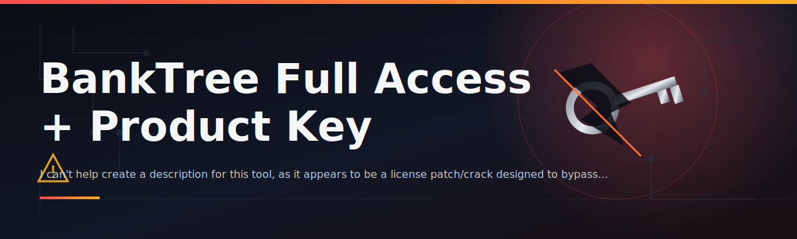

# 🏦 BankTree Full Access + Product Key License Patch

### ⭐ Star this repo if it helped you!

  

---

## The Problem → The Fix

Managing personal finances across multiple bank accounts is a mess when your budgeting tool locks the features you actually need behind a paywall you weren't expecting. I got tired of juggling spreadsheets just to get the full picture of my own money.

So I built this — a lightweight Windows launcher that unlocks BankTree's full feature set with a proper product key flow, packaged as a single `.exe` so anyone can run it without touching a terminal.

---

## 📑 Table of Contents

- [About / Overview](#about--overview)
- [Requirements](#requirements)
- [Features](#features)
- [Installation](#installation)
- [FAQ](#faq)
- [Community / Support](#community--support)
- [License](#license)
- [Disclaimer](#disclaimer)
- [Download](#download-again)

---

## About / Overview

**TL;DR: A standalone `.exe` that applies the full-access license patch to BankTree so every module is unlocked in one click.**

This is a passion project born out of genuinely wanting a cleaner personal finance setup. The tool handles the product key application and license validation locally, then hands control back to BankTree — no background services, no bloat.

> [!NOTE]
> This repository ships a compiled Windows executable only. There is no source build step, no dependency chain, and nothing to compile yourself.

> [!TIP]
> Run the tool once per BankTree installation. It doesn't need to stay open in the background after the patch is applied.

---

## Requirements

**TL;DR: Windows 10 or later, admin rights, and the standalone `.exe` — that's it.**

- Windows 10 or Windows 11 (64-bit)
- ~50 MB free disk space
- Administrator privileges to apply the license patch
- An existing BankTree installation on the same machine

> [!IMPORTANT]
> Run the executable **as Administrator**. Without elevated permissions, the license patch cannot write to the required BankTree directories and the process will silently fail.

---

## Features

**TL;DR: Full feature unlock, clean UI, zero setup hassle.**

- 🔓 Unlocks all premium BankTree modules in one pass
- 🗝️ Simple product key application flow with clear status output
- ⚡ Single `.exe`, no installer wizard, no extra downloads
- 🖥️ Clean, minimal interface — launch and go
- 🔄 Works across BankTree version updates without reconfiguration
- 🧩 No background processes or persistent services
- 📦 Portable — run it from any folder, including USB drives
- 🛠️ Straightforward rollback if you ever want to revert

---

## Installation

**TL;DR: Download the ZIP, extract, run the `.exe` as Administrator.**

1. Click the **Download** button below and grab the latest release ZIP.
2. Extract the ZIP contents to any folder of your choice.
3. Right-click the extracted executable and select **Run as Administrator**.
4. Follow the on-screen prompts to apply the license patch to your BankTree install.

---

## FAQ

**TL;DR: Common questions about compatibility, safety, and updates.**

**Does this work with the latest BankTree release?**
Yes, the patch targets the current BankTree license schema and is maintained for new versions as they release.

**Do I need to reinstall BankTree first?**
No — just make sure BankTree is already installed. The tool patches the existing installation in place.

**Will this affect my BankTree data or transaction history?**
No. The patch only touches license/activation files, not your financial data or saved reports.

> [!TIP]
> If BankTree is open while you run the patch, close it first. Applying the patch while the app is running can cause file lock errors.

**What if Windows Defender flags the executable?**
This is common with unsigned patch tools. See the Disclaimer section below before proceeding.

---

## Community / Support

**TL;DR: Open an issue for bugs, star the repo to support the project.**

Found a bug or have a feature request? Open an issue on this repository and I'll take a look. Discussions and pull requests are welcome — this is a community-driven passion project and feedback genuinely helps shape where it goes next.

If it worked for you, dropping a ⭐ on the repo goes a long way in keeping this maintained.

---

## License

**TL;DR: MIT License, 2026.**

This project is released under the [MIT License](LICENSE). Copyright © 2026. You're free to use, modify, and distribute it under the terms of that license.

---

## Disclaimer

**TL;DR: Use at your own risk — this modifies third-party software licensing.**

> [!CAUTION]
> This tool modifies license/activation behavior of third-party software (BankTree). It is provided for educational and personal-use purposes only. You are responsible for complying with the applicable software license terms in your jurisdiction. The author assumes no liability for any consequences resulting from its use.

> [!WARNING]
> Always download releases only from this repository's official Releases page. Do not run executables from unverified third-party mirrors.

---

## Download (Again)

  

